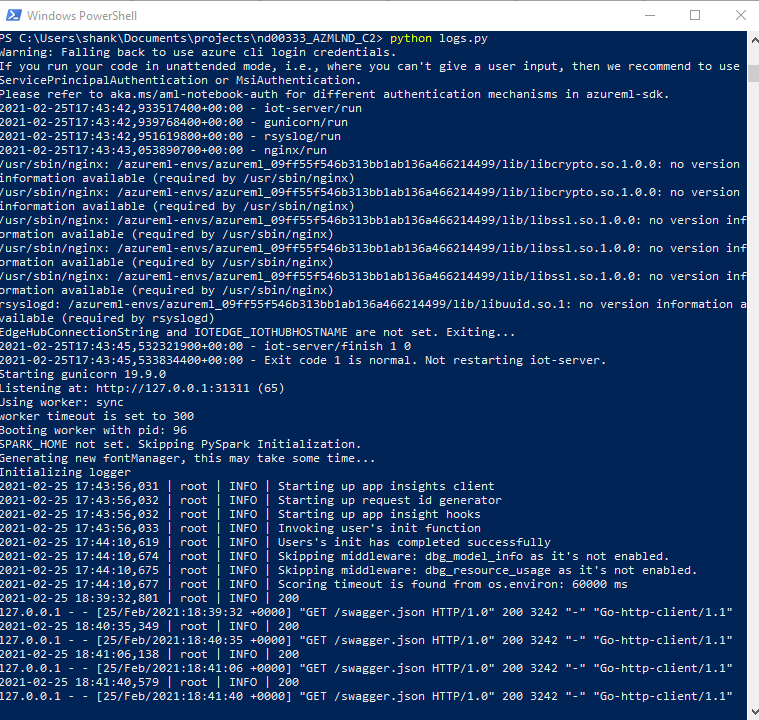
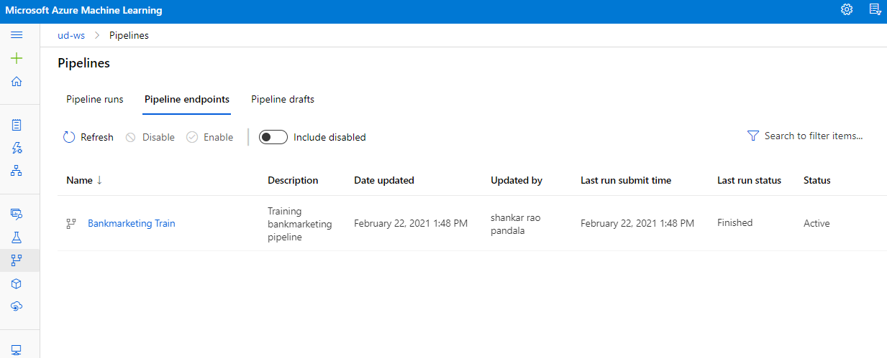

# Bank Marketing Classification

This dataset contains data from a direct marketing campaign through phone calls of a Portuguese banking institution. The classification goal is to predict if a client will subscribe to one of the bank's product: bank term deposit, represented by the variable, y.

This model is then deployed as a REST endpoint so that others can query it and get a prediction. For Debugging and Monitoring purposes the logging was enabled.

[Bank Marketing Dataset](https://automlsamplenotebookdata.blob.core.windows.net/automl-sample-notebook-data/bankmarketing_train.csv)

For more details of the dataset visit [Bank Marketing](https://archive.ics.uci.edu/ml/datasets/bank+marketing)

## Architectural Diagram

# Key Steps
## Service Principal
Service Principal is created using Azure Cli as shown below using the azure cli commands provided in the lessons

## Dataset
Dataset provided in the project is uploaded to the azure blobs of workspace datastore. 

## AutoML Experiment
An AutoML experiment is created and run for the dataset, as shown below

## Best Model
AutoML executed multiple models and varius types of algorithms we can se the metrics as below

## Deployment
Best model which is the outcome of the AutoML runs is deployed as show below

## Logging
We choose the best model for deployment and enable "Authentication" while deploying the model using Azure Container Instance (ACI). The executed code in logs.py enables Application Insights. "Application Insights enabled" is disabled before executing logs.py.

## Enable AppInsights
AppInsights are enabled using the log.py script

## SwaggerUI
Swagger is used to get the documentation of the api as below for get and post  methods.

## Consuming
we can test the deployed endpoint using the endpoint.py script which has sample input payloads

## Pipeline Deploy

Deploying Pipeline as endpoints is a methods to deploy pipelines that can be called by a rest endpoint which runs on scalable compute clusters instead of ACI/AKS for Real time endpoinds.

We can see deployed automl pipeline as an endpoint with active status

Pipelines endpoints tab in endpoints provides us the details of all the pipeline endpoints that are deployed. Here is the pipeline endpoint we deployed

## Pipeline Endpoint
deployed Pipeline endpoint

## Pipeline Run
Below is the example of the pipeline run that is invoked by calling the pipeline rest endpoint that was deployed in previous steps

## Screen Recording

[Link to Screencast Recording](https://youtu.be/J067tN5ZBzU)

## Standout Suggestions
### Improving the project

Some ways to improve this project are:

 - Data has lot of imablance in the classes. Aaccuray is not the right metric to use in this scenario and we can make efforts to handle imbalance in the classes
 - Efficient handling of outliers can lead to further improvement of the model
 - Applying feature selection techniques might improve the model
