# Bank Marketing Classification

This dataset contains data from a direct marketing campaign through phone calls of a Portuguese banking institution. The classification goal is to predict if a client will subscribe to one of the bank's product: bank term deposit, represented by the variable, y.

This model is then deployed as a REST endpoint so that others can query it and get a prediction. For Debugging and Monitoring purposes the logging was enabled.

[Bank Marketing Dataset](https://automlsamplenotebookdata.blob.core.windows.net/automl-sample-notebook-data/bankmarketing_train.csv)

For more details of the dataset visit [Bank Marketing](https://archive.ics.uci.edu/ml/datasets/bank+marketing)

## Architectural Diagram

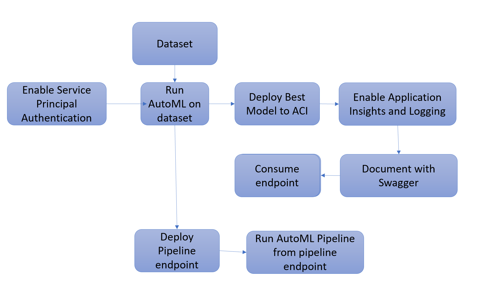

# Key Steps
## Service Principal
Service Principal is created using Azure Cli as shown below
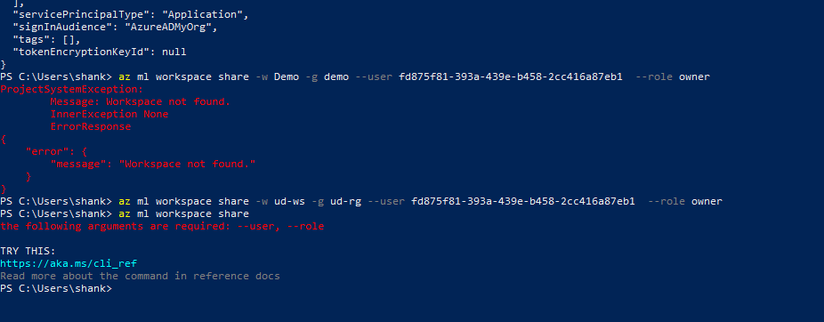

## Dataset
Dataset provided in the project is uploaded to the azure blobs of workspace datastore. 
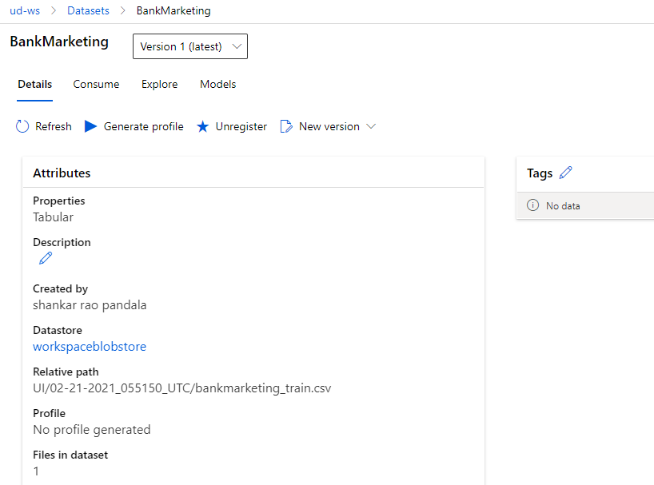

## AutoML Experiment
An AutoML experiment is created and run for the dataset, You can see the completed run below
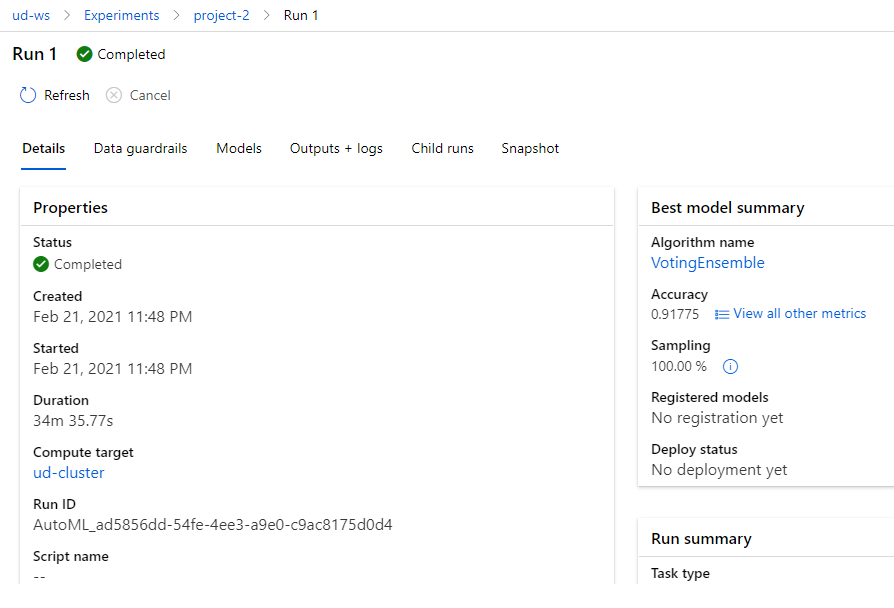

## Best Model
AutoML executed myltiple models and we can se the metrics as below
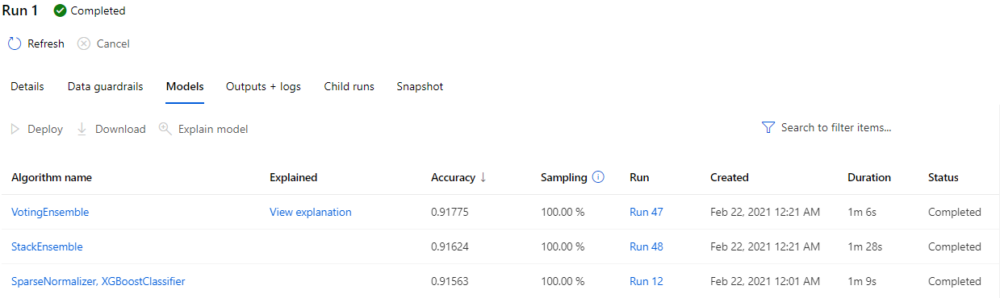

## Deployment
Best model is deployed as show below
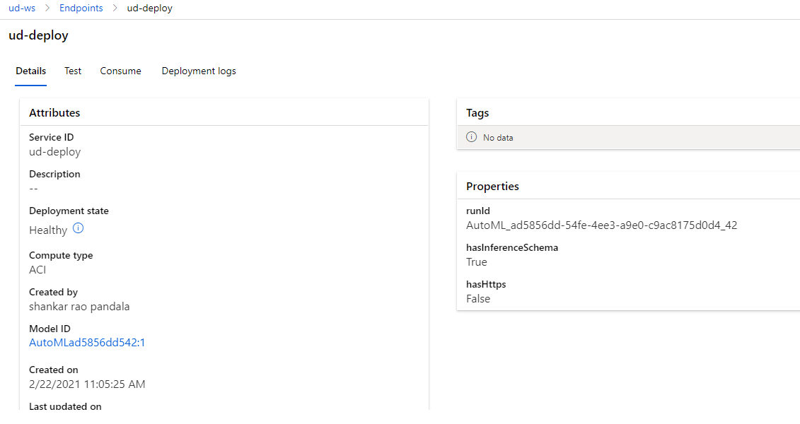

## Enable AppInsights
AppInsights are enabled using the log.py script
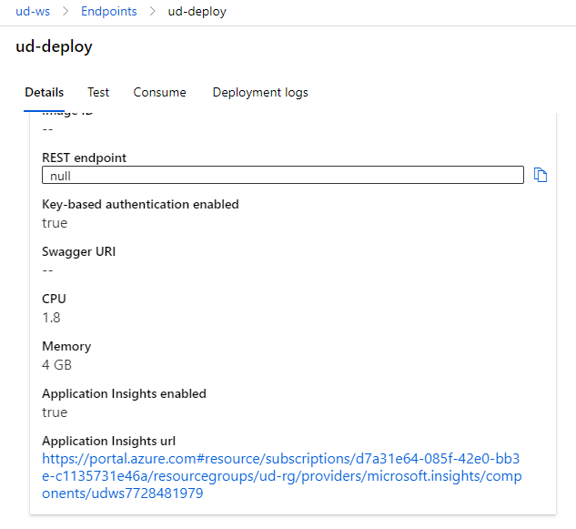

## Logging
Logs can be verified by using log.py script and insights dashboard

## SwaggerUI
Swagger is used to get the documentation of the api as below for get and post  methods.
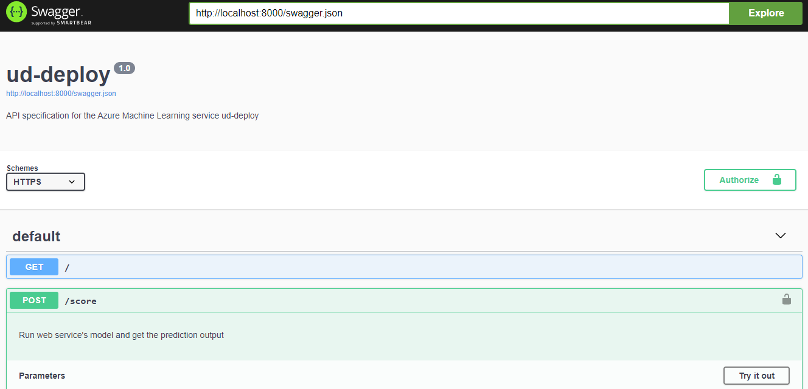
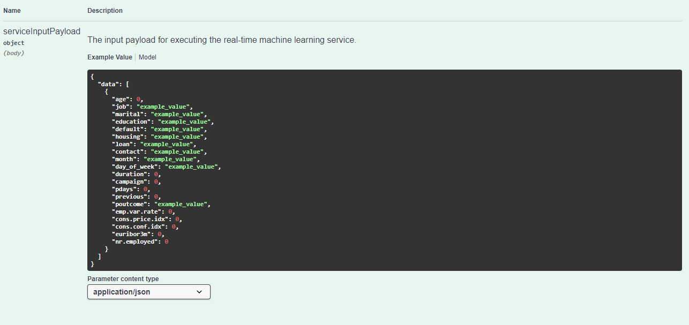
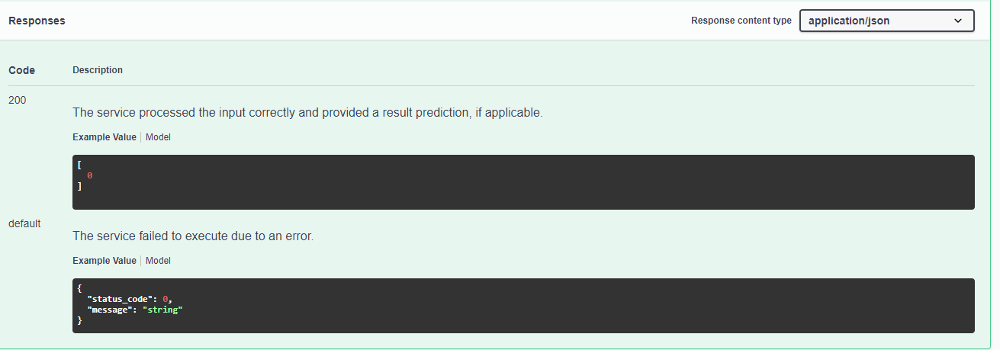

## Consuming
we can test the deployed endpoint using the endpoint.py script which has sample input payloads
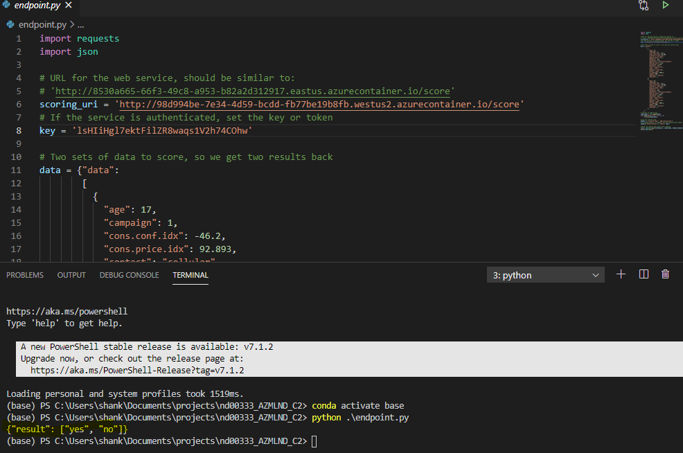

## Pipeline Deploy
Deploy automl pipeline as an endpoint
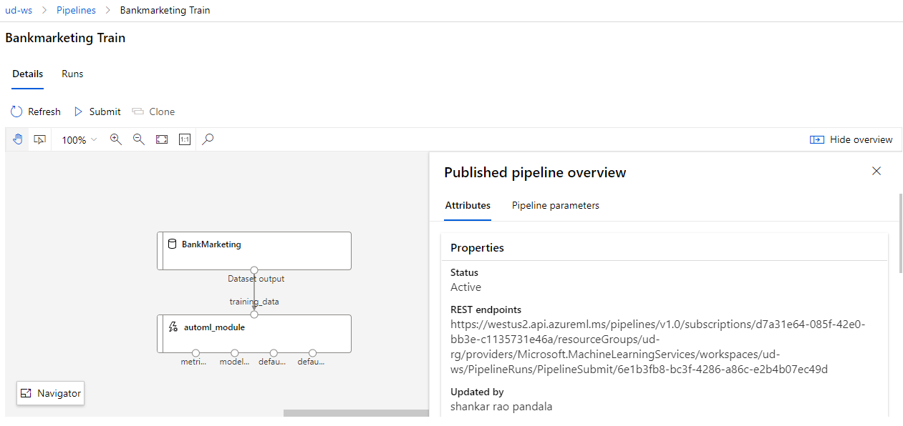

## Pipeline Endpoint
deployed Pipeline endpoint
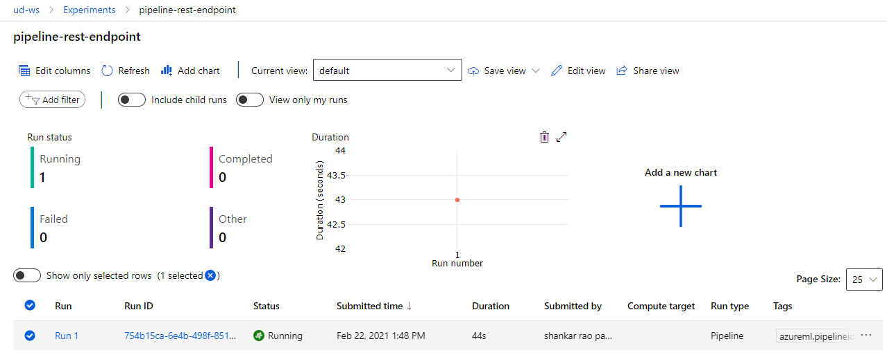

## Pipeline Run
Run initiated with pipeline endpoint
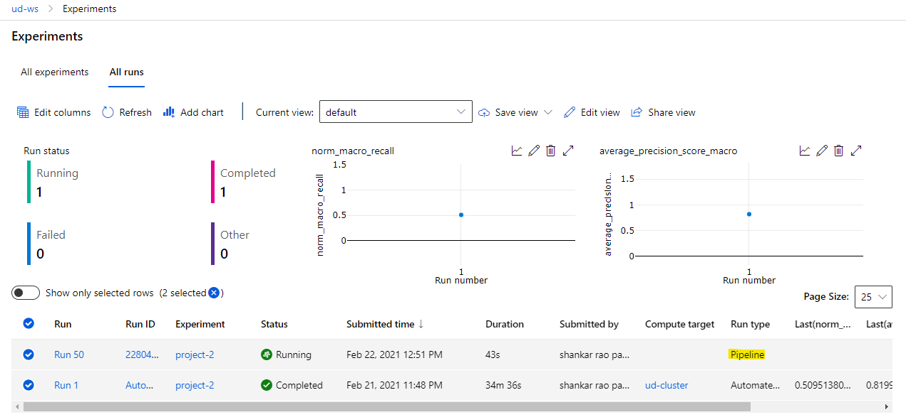

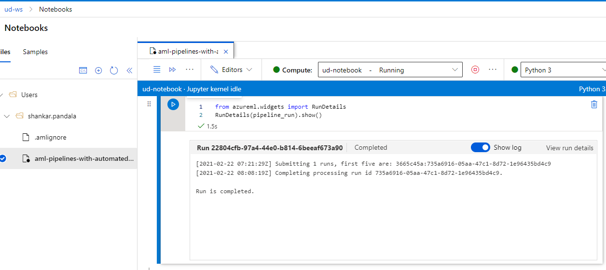

## Screen Recording
*TODO* Provide a link to a screen recording of the project in action. Remember that the screencast should demonstrate:

